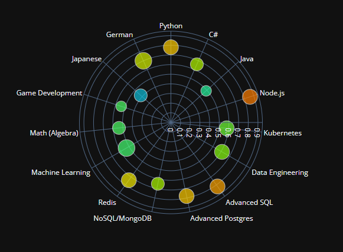

# Strategic Life

## Description

Strategic Life is a small Jupyter Notebook that allow to list down and rate the skills we want to learn. Given the
features of each skill they will be plotted on a radar chart so we can easily prioritize our learning.

An example of the resulting graph:

## Skills Definition

The `skills` dictionary allows to define the 5 features for each skill:

- **Enjoyment**: How much you enjoy doing this activity. Are you excited?
- **Value**: What's the business value: job demand, salary compensation, market growth. Value must also be set to high if the skill open opportunities that would otherwise remain closed. For example Python will open the door to AI/ML, Data Science, and is also valuable for web development.
- **Skills**: Your current ability in this domain.
- **Difficulty**: How difficult it is for you to learn that skill.
- **Proximity**: This is related to the concept of zone of proximal development. High proximity (5) means close to the current skills. This is closely related to skills but different. For example, you can have no skill in a particular domain, but the proximity is still high because you have related knowledge. Proximity also denote how strong the synergy is with your current skills.

The `weights` list is simply giving more or less importance to some of the features.

